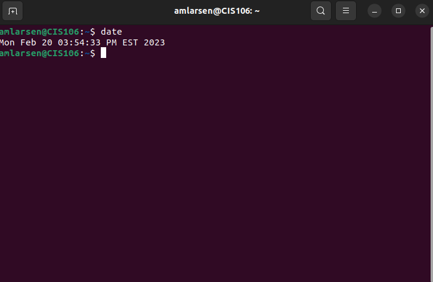

---
Aaron Larsen
course: cis106
semester: Spring 23
---

# Lab 3 Submission

## Question 1

## Question 2

## Question 3

| Program purpose     | Package Name     | Version                            |
| ------------------- | ---------------- | ---------------------------------- |
| Play a tetris game  | blockattack      | 2.7.0-1                            |
| Play a video file   | dragonplayer     | 4:21.12.3-0ubuntu1                 |
| Browse the internet | epiphany-browser | 42.4-0ubuntu1                      |
| Read your email     | clawsmail        | 4.0.0-3                            |
| Play music          | clementine       | 1.4.0~rc1+git347-gfc4cb6fc7+dfsg-2 |

## Question 4

| command | what it does                                            |
| ------- | ------------------------------------------------------- |
| echo    | says the given text you type                            |
| fortune | print something completely random after your message    |
| cowsay  | generates a cow that says the given text you type       |
| lolcat  | highlights the given text you type                      |
| figlet  | Display large character made up of different characters |
| toilet  | Display a large color text                              |
| rig     | Gives us a random identity with personal information    |