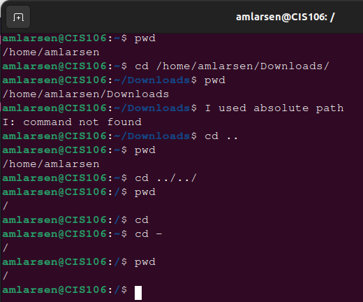
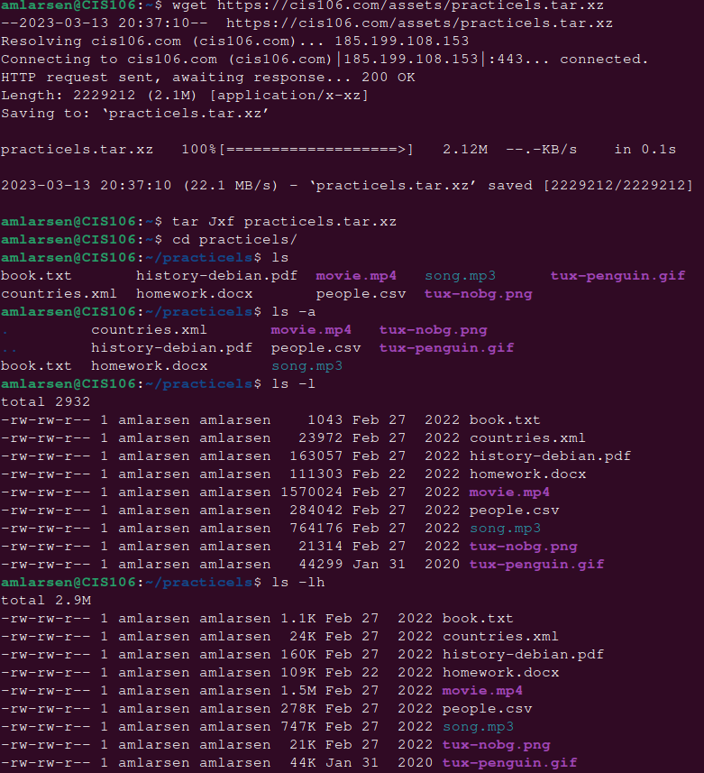
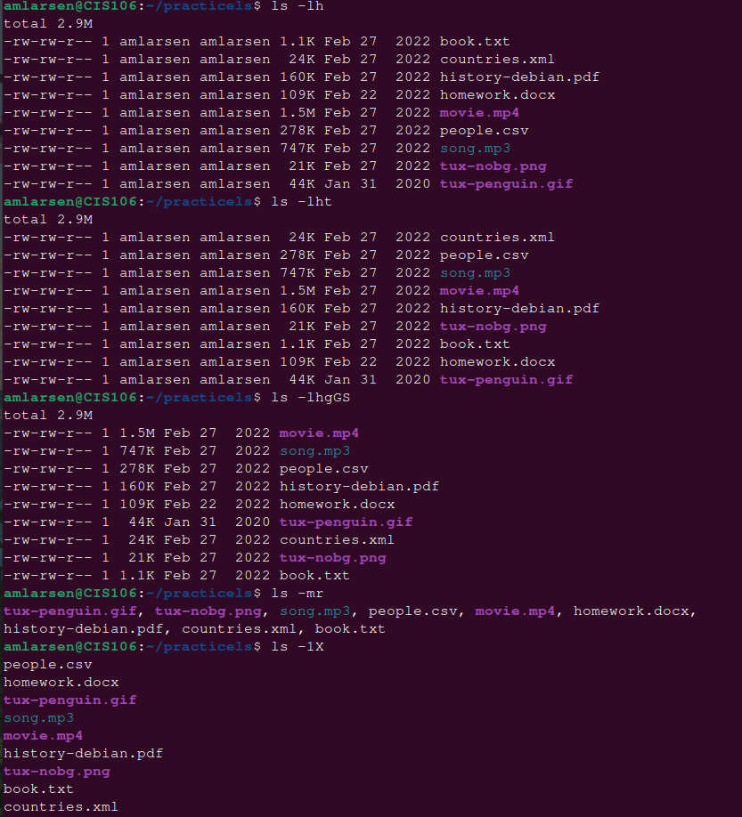
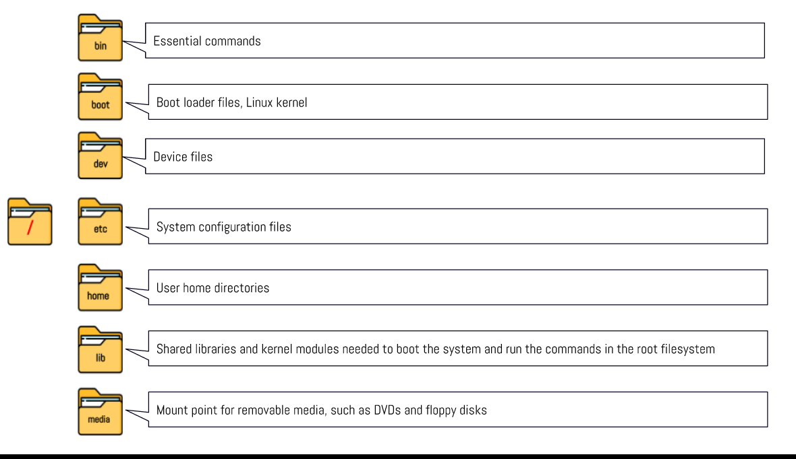
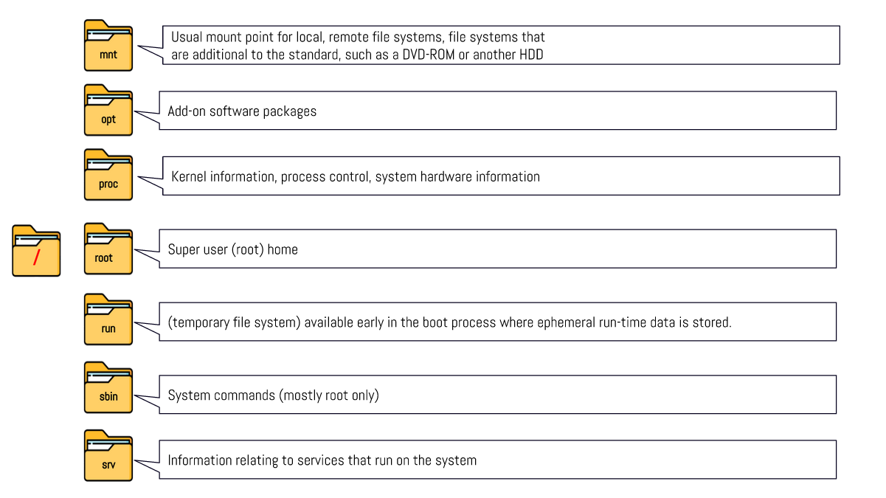
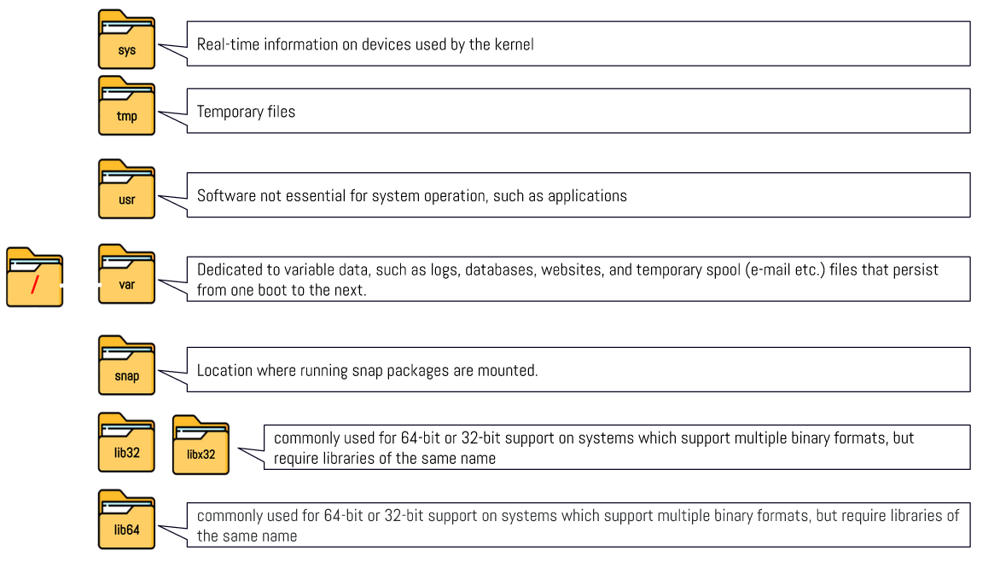

# Week Report 4

## Practice from the presentation The Linux File system:
## Practice 1 Solution

## Practice 2 Solution

## The Linux File system directories and their purpose:

## All the commands for navigating the filesystem

| command | what it does                       | Syntax         | Example         |
| ------- | ---------------------------------- | -------------- | --------------- |
| pwd     | Prints out the current directory   | pwd            | `home/amlarsen` |
| list    | Shows a list of files in directory | ls 'letter'    | `ls --help`     |
| cd      | Changes the working directory      | cd 'directory' | `cd /usr/share` |

## Basic terminology
* **File system** - The way files are stored and organized
* **Current directory** - The current directory that you are in
* **parent directory** - The current directory that you are in and have the options to move to another directory.
* **the difference between your home directory and the home directory** -Absolute path starts from the root and relative and relative path goes to the file that is in the current "directory"
* **pathname** -it indicates the location of the file in the filesystem
* **relative path** the location of a file starting from the current working directory 
* **absolute path** - the location of a file starting at the root of the file system 

