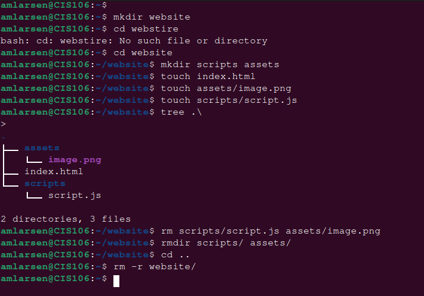
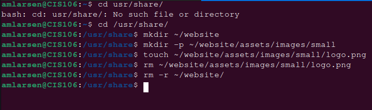
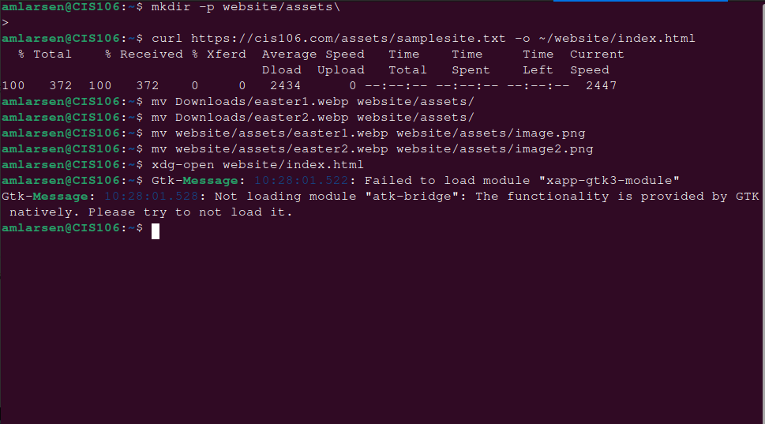
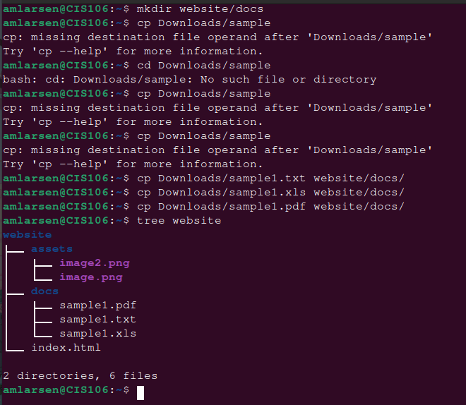

---
Aaron Larsen
CIS 106
Spring 2023
---

## Questions ##
**What are Command Options?**
Command options are options that can help modify/ enhance their behavior

**What are Command Arguments?**
Command Arguments are the items open which the command acts on

**Which command is used for creating directories? Provide at least 3 examples.**
 - mkdir
 - Example 1) mkdir puppies
 - Example 2) mkdir music
 - Example 3) mkdir videos

**What does the touch command do? Provide at least 3 examples.**
The touch command is used for creating files
- Example 1) touch puppies
- Example 2) touch ~/puppies_photo.jpeg
- Example 3) touch list_of_puppies.txt puppy_names.txt

**How do you remove a file? Provide an example.**
Use the command option rm
- Example) rm list_of_puppies.txt

**How do you remove a directory and can you remove non-empty directories in Linux?Provide an example**
to remove a directory you would use rmdir for empty directories and rm -r **directory name**

**Explain the mv and cp command. Provide at least 2 examples of each**
1) The mv command moves/ rename the file/directory that you would like to move
   1)  mv puppies/puppies_photo.jpeg home/Pictures
   2)  mv list_of_puppies.txt home/Documents

2) The cp command copies files/directories from a source to a destination
    1) cp -r ~/puppies/Desktop
    2) cp puppies/puppies_photo.jpeg Pictures/
### Practice Questions ###

